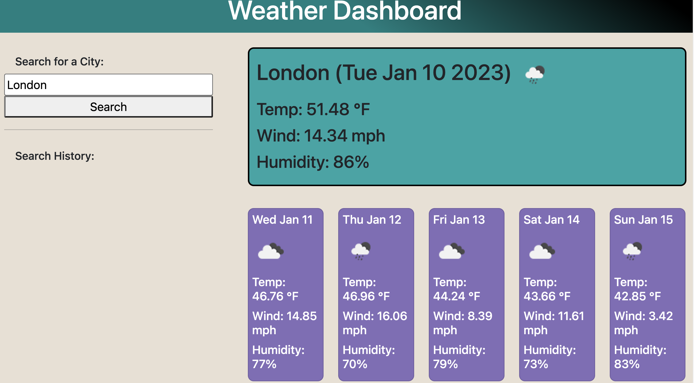

# Weather Dashboard

## Description

Whether you're planning out your work week or a trip, you need to know the weather forecast for any city you might travel to. With this simple weather application, you'll be able to search any city and find the current weather and a five-day forecast for that city. It provides the temperature, wind speed, and humidity, as well as a helpful icon of the day's weather outlook. It is easy to use and distraction-free!

## Installation

This is a deployed website, so no installation is required.

## Features

The five-day forecast will help you plan out your week or your trip with ease.
The search history will allow you to check the weather of recent searches without having to retype the city name.
The minimalist design provides a calm, distraction-free environment.

## License

MIT License

## Credits

Weather data provided by OpenWeatherMap.org.
Study Group: Mia Ciasullo and Frederick Chang.
Tutor: Geronimo Perez.

## Usage

Website Link: https://oconnell-coder.github.io/weather-dashboard/
*Please note: this site will not work without the API key that I provided in the homework submit file (on Bootcamp Spot) for security purposes.

GitHub Link: https://github.com/OConnell-Coder/weather-dashboard
*The API key in my code is in a separate JavaScript file that I added to my gitignore folder for security purposes.

